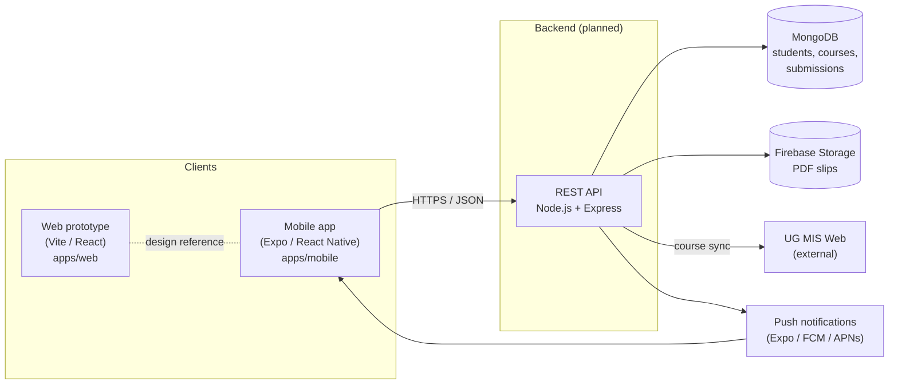
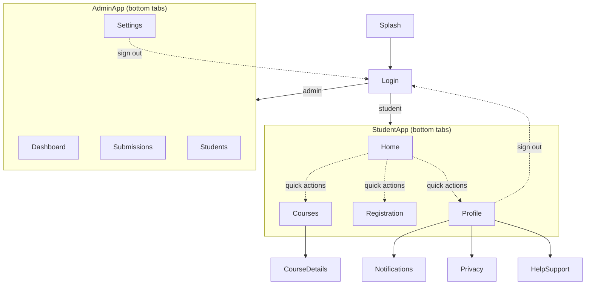
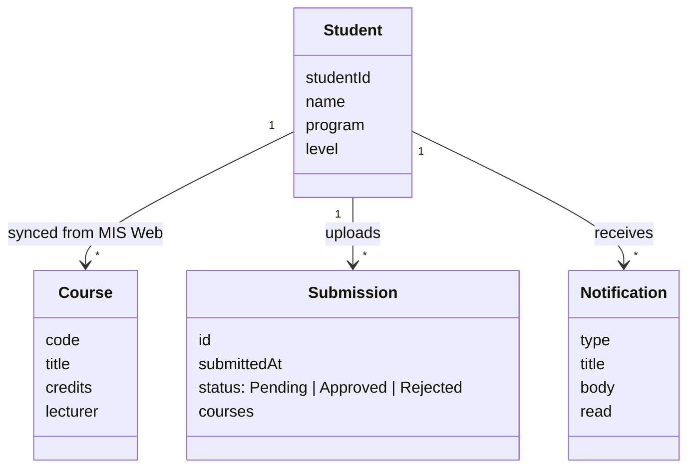
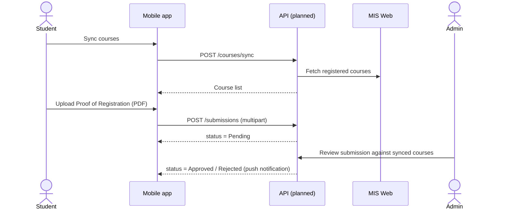

# Architecture

The UG CS Department Registration App lets students sync their officially registered courses from MIS Web, upload
their Proof of Registration, and track departmental clearance. Administrative staff review and approve or reject
submissions. See the [project proposal](project/Stephanie_Awrabena_Dunyo_Final_Year_Project_Updated.pdf) for the full
problem statement, objectives and scope.

> **Status:** the mobile app is a UI prototype driven by sample data (`apps/mobile/src/data/sampleData.ts`).
> The backend, database and file storage below are the target design from the proposal and are not built yet.

## System overview



| Layer       | Technology                        | Responsibility                                                  |
| ----------- | --------------------------------- | --------------------------------------------------------------- |
| Mobile app  | Expo SDK 54, React Native 0.81    | Student and admin UI, iOS + Android                             |
| Web         | Vite, React 18, Tailwind v4       | Clickable design prototype exported from Figma Make             |
| API         | Node.js + Express (planned)       | Auth, course sync, file upload, verification workflow           |
| Database    | MongoDB (planned)                 | Student profiles, synced courses, submission records            |
| File store  | Firebase Storage (planned)        | Uploaded Proof of Registration PDFs                             |
| Design      | Figma + `@ug-cs/design-tokens`    | Visual identity, shared across web and mobile                   |

## Repository layout

```
.
├── apps/
│   ├── mobile/                  Expo app (the product)
│   │   ├── App.tsx              Root stack navigator
│   │   ├── index.ts             Entry point (registerRootComponent)
│   │   ├── metro.config.js      Pins React to this app's copy (see ADR 0003)
│   │   └── src/
│   │       ├── navigation/      StudentApp, AdminApp tab navigators
│   │       ├── screens/         LoginScreen, SplashScreen
│   │       │   ├── student/     Home, Courses, CourseDetails, Registration, Profile, …
│   │       │   └── admin/       Dashboard, Submissions, Students, Settings
│   │       ├── components/      Shared UI (PrimaryButton, StatusBadge, StatusBarBackground)
│   │       ├── constants/       Colors (re-exported from design tokens)
│   │       ├── data/            Sample data, to be replaced by API calls
│   │       └── types/           Domain types (Course, Submission, Notification)
│   └── web/                     Figma Make prototype
│       └── src/
│           ├── app/             App.tsx + shadcn/ui components
│           └── styles/          Tailwind + theme (consumes token CSS)
├── packages/
│   └── design-tokens/           Single source of truth for colors, radii, type
│       ├── tokens/              DTCG JSON (edit these)
│       ├── generated/           CSS / JS / d.ts / JSON outputs (committed)
│       └── scripts/             build, check, lint-colors
└── docs/
    ├── architecture.md          This file
    ├── design-principles.md     Visual identity and UI rules
    ├── decisions/               Architecture decision records (ADRs)
    └── project/                 Final year project proposal (PDF)
```

Dependency direction is one way: `apps/*` depend on `packages/*`; packages never import from apps, and the two apps
never import from each other.

## Mobile app

### Navigation



- `App.tsx` owns a native stack: `Splash → Login → StudentApp | AdminApp`, plus modal-style detail screens
  (`CourseDetails`, `Notifications`, `Privacy`, `HelpSupport`) that sit above the tabs. Sign-out uses
  `navigation.replace("Login")` so the back gesture can't return to an authenticated screen.
- Each role has its own tab navigator in `src/navigation/`. Screens are grouped by role under `src/screens/student`
  and `src/screens/admin`.
- Route params are typed (`RootStackParamList`, `StudentTabParamList`).

### Domain model



`VerificationStatus` (`Pending | Approved | Rejected`) drives the core workflow and is always shown with the same
color and icon (see [design principles](design-principles.md#status-semantics)).

### Clearance workflow



### Data layer (next step)

Screens currently import from `src/data/sampleData.ts`. When the API exists, add `src/api/` (typed client) and
data hooks (e.g. `useCourses`, `useSubmissions`) so screens stay free of fetch logic; `src/types` stays the contract
shared by both.

## Web prototype

`apps/web` is a single-page export from Figma Make used as a design reference. It is not the shipped product. It
consumes the same design tokens via `@ug-cs/design-tokens/tokens.css`, so brand changes apply to both apps.

## Tooling

| Command               | Purpose                                         |
| --------------------- | ----------------------------------------------- |
| `pnpm dev:mobile`     | Start Expo / Metro                              |
| `pnpm dev:web`        | Start the Vite prototype                        |
| `pnpm tokens:build`   | Regenerate design token outputs                 |
| `pnpm tokens:check`   | Fail if generated tokens are stale              |
| `pnpm design:lint`    | Report hardcoded colors that should be tokens   |
| `pnpm typecheck`      | Type-check all workspaces                       |

## Decisions

- [0001 – pnpm monorepo](decisions/0001-pnpm-monorepo.md)
- [0002 – Shared design tokens](decisions/0002-shared-design-tokens.md)
- [0003 – One React copy per app](decisions/0003-one-react-per-app.md)
